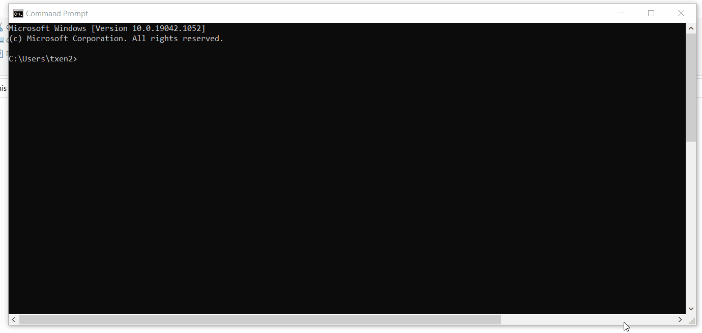

# Hospital System Database
SQL Project on Hospital System
Task:
1. Analyse Business Requirement for the Hospital System
2. Design ERD and EERD of the Hospital System
3. Create Data Dictionary for the Database
4. Design the SQL script from the ERD and fill in with data from Data Dictionary

## Groupmates
1. Yeoh Siow Poo (Leader)
2. Felix Len Wen Jun
3. Tan Xi En
4. Yew Jei Wey

## Learning Objective
1. Familiarize myself with SQL Syntax
2. Familiarize myself with SQL procedures, Queries and Functions
3. Learn to Draw ERD and EERD
4. Learn to design a SQL Database and program the script

## IDE Used
Visual Studio Code

## Demonstration
0. Navigation
   
1. Get the Total Expenses by Each Department - Sum Function of Staff in Department
   ``` sql
   col "List of Doctors" format a80 
   col "Total Expenses" format a20
   SELECT
    department.department_id "ID",
    department.department_name "Name",
    tmp.num_of_employees "Number of employees",
    tmp.names "List of Doctors",
    'RM' || ' ' || tmp.total_expenses "Total Expenses"
   FROM
    department,
    (
        SELECT
            department_id,
            TO_CHAR(SUM(staff_salary), '999,999.99') total_expenses,
            COUNT(department_id) num_of_employees,
            LISTAGG(staff_lname || ' ' || staff_fname, ', ') WITHIN GROUP (
                ORDER BY
                    staff_lname
            ) names
        FROM
            staff
        GROUP BY
            department_id
    ) tmp
   WHERE
    tmp.department_id = department.department_id;
   ```
   
2. Update Department Salary (Stored Procedure)
   ``` sql
   CREATE OR REPLACE PROCEDURE GIVE_BONUS_DEPARTMENT(
    current_dept_name IN varchar2,
    bonus_salary IN decimal
   ) AS BEGIN FOR staff_ptr IN (
    SELECT
        s.staff_id
    FROM
        staff s,
        department d
    WHERE
        s.department_id = d.department_id
        AND d.department_name = current_dept_name
   ) loop GIVE_BONUS_STAFF(staff_ptr.staff_id, bonus_salary);END loop;
   END;
   ```
   #### Before ####
   
   #### After ####
   
3. Determine If Staff is Junior Employee or Senior Employee (Function)
    ``` sql
    CREATE OR replace FUNCTION Determine_staff_experience(current_stf_id IN VARCHAR2)
    RETURN VARCHAR2
    IS
    staff_experience_txt VARCHAR2(100);
    hire_date            DATE;
    BEGIN
    SELECT staff_hiredate INTO   hire_date FROM   staff WHERE  staff_id = current_stf_id;

    IF Trunc(( SYSDATE - hire_date ) / 365.25) >= 3 THEN
      staff_experience_txt :=
      'This Staff has more than 3 years experience and is a Senior Employee.';
    ELSE
      staff_experience_txt :=
      'This Staff has less than 3 years experience and is a Junior Employee.';
    END IF;

    RETURN staff_experience_txt;
    END;  
    ```
    
